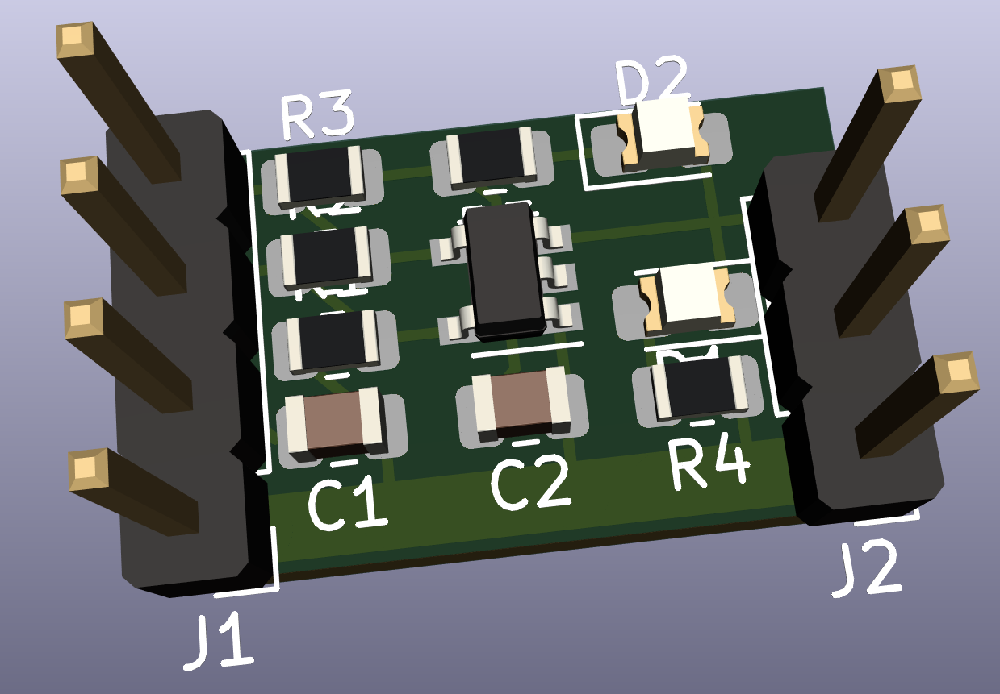
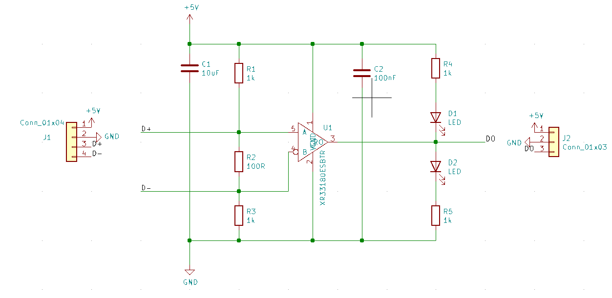
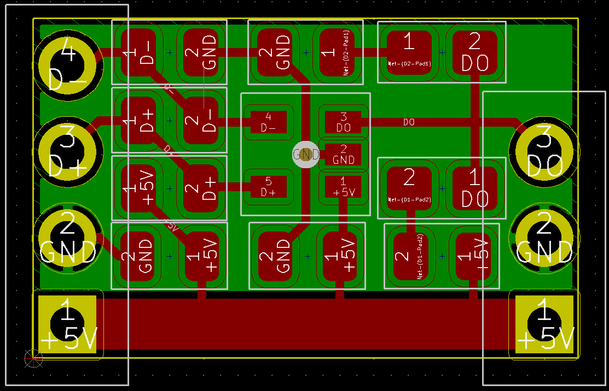

# diff-rcvr

Single unidirectional RS-485/RS-422 differential to single-ended receiver.

 

This 10x20mm PCB is designed to be soldered on or near a strip of WS2812B programmable LEDs to increase the range and improve noise immunity on the data line.

| Schematic | PCB Layout |
:-------------------------:|:-------------------------:
 | 

