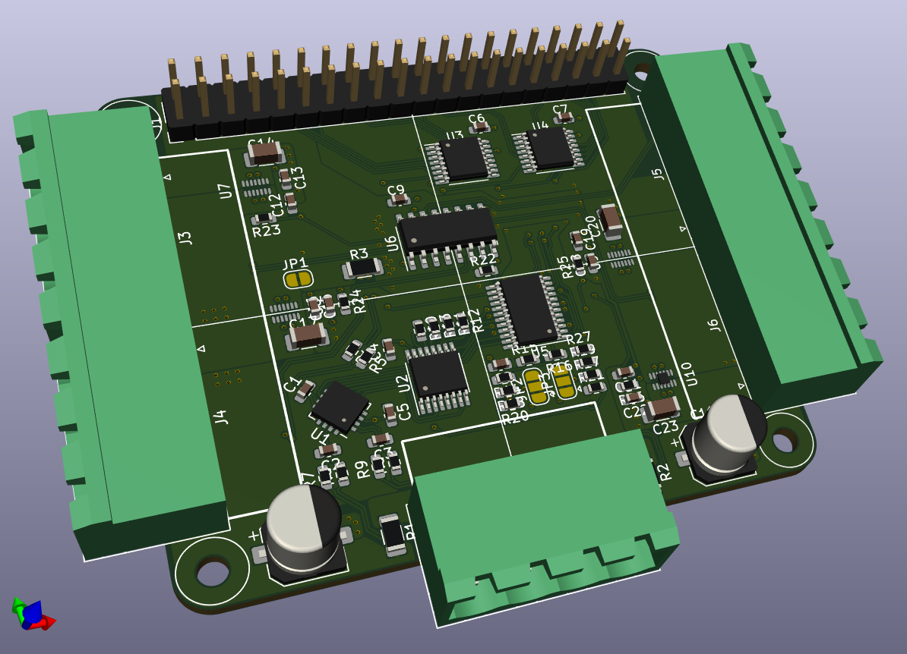
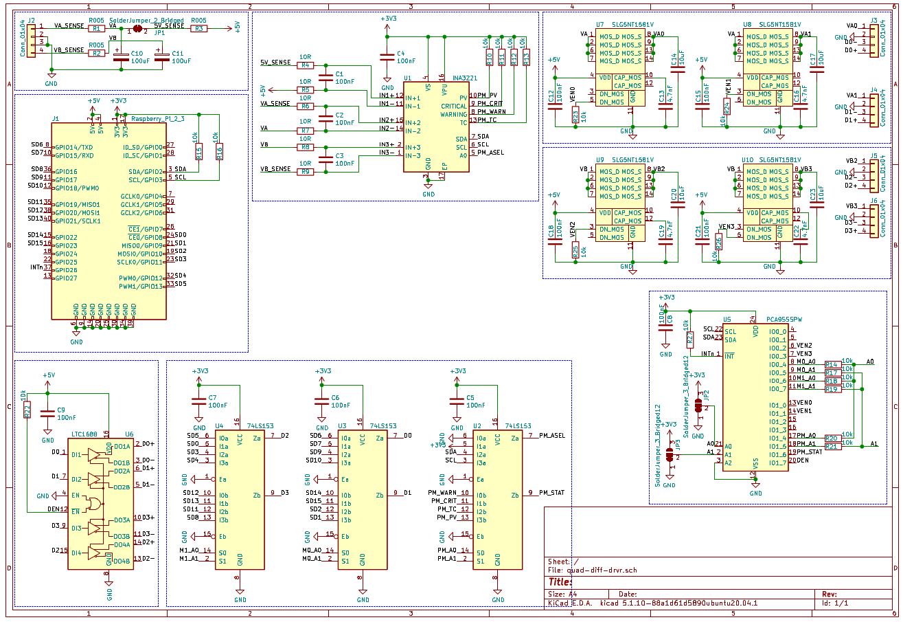
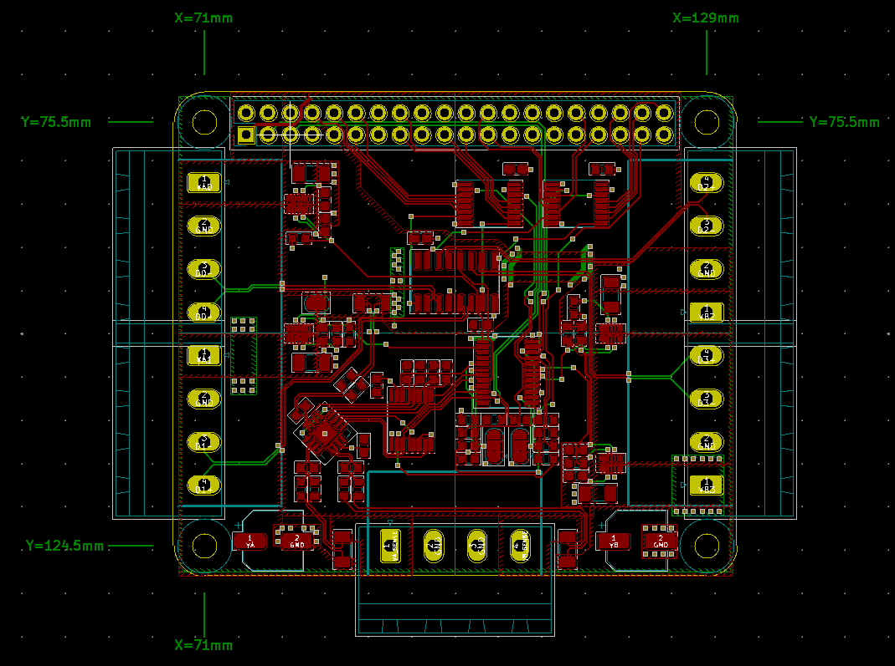

# quad-diff-driver

 - is a Pi HAT that can stack 4x to a Pi
 - total of 16 strips to a Pi with this cool [parallel driver](https://iosoft.blog/2020/09/29/raspberry-pi-multi-channel-ws2812/) code
 - Drive 4x 150 LED strips up to 9A per channel out
 - Uses quad differential RS-485 driver for 1m+ runs of twisted pair data line
 - Control power out to each strip individually
 - Power monitoring of VA , VB, Pi 5V in/out with interrupt signals
 - max 30A all channels per HAT, 15A per VA / VB on a HAT
 - Should cost around $16 in parts ([BoM](https://docs.google.com/spreadsheets/d/1N1vn6LuwAwEPZ860a-0pwzuY52BjjF7snLwd1W7JV2M/edit?usp=sharing)) + $2.5 per PCB ([DirtyPCB](https://dirtypcbs.com/store/pcbs/about)) at quantity

| Schematic ([PDF](img/quad-diff-drvr.pdf)) | PCB Layout |
:-------------------------:|:-------------------------:
 | 
